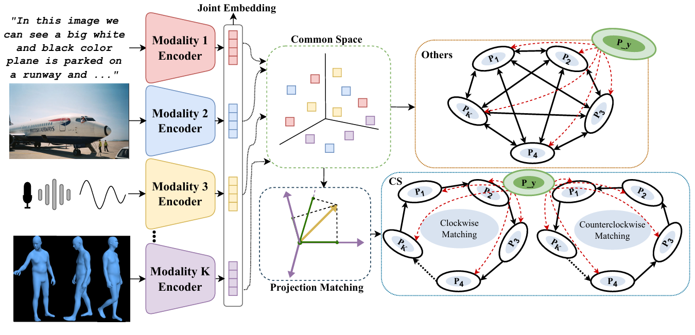

# Cross-Modal Retrieval with Cauchy-Schwarz Divergence

Official PyTorch implementation of the paper
**"Cross-Modal Retrieval with Cauchy-Schwarz Divergence" (ACM MM'25)**.

This work addresses the **limitations of existing cross-modal retrieval (CMR)** methods—such as **numerical instability** and **inefficient alignment of multi-modal data**—by introducing a novel loss function:

- **Cauchy-Schwarz (CS) Divergence**
- **Generalized Cauchy-Schwarz (GCS) Divergence**
<p align="center">

</p>

## 🚀 News

- **[2025/08/01]** First release 🎉

## 📦 Model Zoo

| Setting  | Datasets | Avg. | Weights |
|----------|:--------:|:--------:|:-------:|
| [language video motion](configs/LVM.yaml) | KIT-ML | 0.811 | - |

**More pretrained weights will be released soon.**

## ⚙️ Installation

### 1. Clone the repository

```
git clone <your-repository-url>
cd LAVIMO
```

### 2. Create Conda environment

We recommend Conda for dependency management.
You can directly build the environment using `environment.yml`.

```
conda env create -f environment.yml
conda activate LAVIMO_env

# PyTorch (CUDA 11.3)
pip install torch==1.12.0+cu113 torchvision==0.13.0+cu113 torchaudio==0.12.0 --extra-index-url https://download.pytorch.org/whl/cu113

# Additional packages
pip install numpy==1.23.4
pip install transformers
pip install opencv-python
```

## 📂 Dataset Preparation

### KIT-ML

1. **Download motions**

   - [AMASS](https://amass.is.tue.mpg.de/download.php) → place in `data/AMASS/`
   - [KIT-ML](https://motion-annotation.humanoids.kit.edu/dataset/) → unzip to `data/kit-mocap/`

2. **Preprocess**

   ```
   python kitml.py
   sh download_smpl_files.sh
   ```

   The script `kitml_text_preprocess.py` generates:

   - `kitml_process/amass-path2kitml.json`
   - `kitml_process/kitml_not_found_amass.json`
     (Already executed for convenience.)

3. **Render motion videos**
   Refer to [TEMOS Rendering Guide](https://github.com/Mathux/TEMOS?tab=readme-ov-file#rendering-motions-high_brightness).

4. **Expected folder structure**

   ```
   data/
   ├── AMASS/
   ├── KIT_mocap/
   ├── KITrender/
   ├── kitml.json
   └── ...
   ```

## 🏋️ Training

Train the model with:

```
python train.py
```

## 🤝 Contributing

Contributions are welcome!
Feel free to **open an Issue** or **submit a Pull Request** for ideas, suggestions, or bug reports.

## 📄 Citation

If you find this project helpful, please cite our paper:

```
@inproceedings{zhang2025cross,
  title={Cross-Modal Retrieval with Cauchy-Schwarz Divergence},
  author={Zhang, Jiahao and Yin, Wenzhe and Yu, Yi and Tang, Suhua},
  booktitle={Proceedings of the 28th ACM International Conference on Multimedia},
  pages={to appear},
  year={2025}
}
```

## 🔗 Related Projects

This project builds upon insights from excellent works:

- [MotionCLIP](https://github.com/GuyTevet/MotionCLIP)
